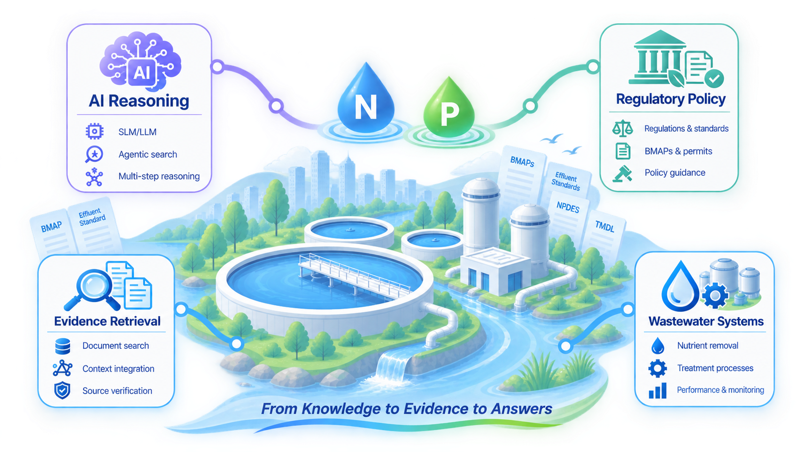
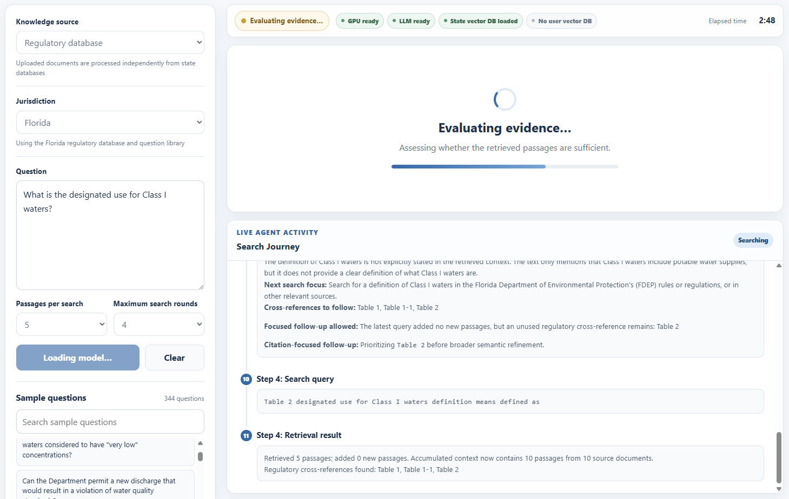
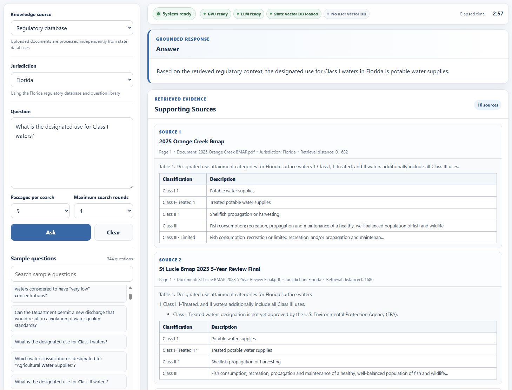

# WNP-ARAG

## Wastewater Nutrient Policy – Agentic Retrieval-Augmented Generation

<p align="center">
  
</p>

**WNP-ARAG** is an interactive research platform for exploring **wastewater nutrient regulations and policies** through natural-language questions. It integrates regulatory knowledge, semantic retrieval, AI-assisted evidence assessment, iterative query refinement, and language-model reasoning within an agentic Retrieval-Augmented Generation (RAG) framework. The framework is designed to support different LLMs/SLMs, with **Llama 3.1 8B Instruct** used as the current demonstration model.

🌐 **Live Platform:**  
https://starfriend10.github.io/WNP-ARAG/

---

## ✨ Key Features

- Natural-language exploration of wastewater nutrient regulations
- Jurisdiction-specific regulatory knowledge bases
- Agentic retrieval with AI-assisted evidence assessment and iterative query refinement
- Evidence-grounded responses with supporting regulatory sources
- Model-flexible framework supporting different LLMs/SLMs
- Current demonstration using the compact **Llama 3.1 8B Instruct** model
- Analysis of user-uploaded documents
- Retrieval process and diagnostics for improved transparency

---

## 🔄 Framework

WNP-ARAG extends conventional RAG by assessing retrieved evidence and conducting additional searches when needed:

```text
Question → Semantic Retrieval → Evidence Assessment
         → Refine/Retrieve if needed → Grounded Generation
```

The framework separates retrieval and evidence assessment from the generation model, allowing different LLMs or SLMs to be integrated. The current online demonstration uses **Llama 3.1 8B Instruct** as a compact model implementation.

For details on the methodology, regulatory databases, and platform usage, please visit the **WNP-ARAG website**.

### 💡 Example

Example of WNP-ARAG exploring a wastewater nutrient regulation question using the current SLM-based demonstration:

<p align="center">
  
</p>

<p align="center">
  
</p>

---

## 📚 Research and Citation

WNP-ARAG is developed as a research platform for investigating how domain-specific retrieval, language models, and agentic workflows can support environmental regulatory intelligence.

Associated publication and citation information will be updated as the research develops.

---

## ⚠️ Disclaimer

WNP-ARAG is an experimental research platform. AI-generated responses are intended for research, educational, and informational purposes and should not be considered legal advice or an authoritative interpretation of environmental regulations.

Users should verify important regulatory information against original regulatory documents and official sources.

---

## ✉️ Contact

For questions, suggestions, or research collaborations, please use the contact information provided through the WNP-ARAG website.
